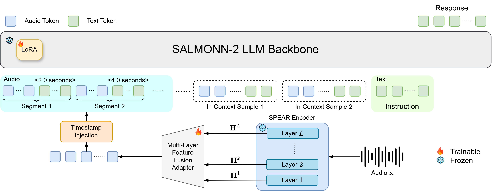

# SALMONN-2
[](https://arxiv.org/abs/)
[](https://huggingface.co/spaces/wsntxxn/SALMONN-2)
[](https://huggingface.co/marcoyang/salmonn-2-8b-test)

This repository contains the supported inference and fine-tuning code for SALMONN-2.


## Contents

- [Introduction](#introduction)
- [Environment setup](#environment-setup)
  - [1. Create and activate an environment](#1-create-and-activate-an-environment)
  - [2. Install SALMONN-2](#2-install-salmonn-2)
  - [3. Optional: install FlashAttention](#3-optional-install-flashattention)
  - [4. Verify the installation](#4-verify-the-installation)
- [Development checks](#development-checks)
- [Quickstart](#quickstart)
- [Inference](#inference)
- [Fine-tune](#fine-tune)
  - [Manifest](#manifest-format)
  - [Fine-tuning command](#fine-tuning-command)


## Introduction
<p align="center">
  
</p>

<!-- ```text
audio -> 128-bin filterbank -> SPEAR -> MLP connector -> Qwen3
``` -->

SALMONN-2 is an open-source audio understanding model with the following key innovations:

- **Unified SSL audio foundation:** SALMONN-2 is built on top of the general-purpose self-supervised [SPEAR audio encoder](https://huggingface.co/marcoyang/spear-xlarge-speech-audio-v2).
- **Multi-layer feature fusion:** The MLF adapter aggregates representations from all encoder layers, making better use of the hierarchical information learned by the SSL encoder.
- **Balanced audio understanding:** The unified encoder delivers strong and well-balanced capability across speech, general audio, music, and paralinguistic tasks.
- **Strong ALLM benchmark performance:** SALMONN-2 achieves state-of-the-art results among comparable-scale models on major audio understanding benchmarks, including MMAU-Pro, MMAR, and MMSU.
- **Multimodal in-context learning:** SALMONN-2 exhibits MICL capabilities through targeted contextual biasing training.

On speech and  audio understanding benchmarks, SALMONN-2 achieves strong results among comparable-scale ALLMs while using substantially less supervised audio-text training data:

| Model | LLM Size | Data (h) | MMAU-Pro | MMAR | MMSU |
| --- | ---: | ---: | ---: | ---: | ---: |
| Qwen2.5-Omni | 8B | -- | 52.2 | 56.7 | 61.3 |
| Kimi-Audio | 8B | &gt;13M | 56.6 | 60.8 | 54.7 |
| MiMo-Audio | 8B | &gt;1M | 53.4 | 61.7 | 61.9 |
| AF-3 | 8B | &gt;55k | 51.7 | 58.5 | 61.4 |
| AF-Next | 9B | &gt;500k | 56.3 | 59.7 | 59.4 |
| MOSS-Audio | 9B | &gt;1M | 57.5 | 64.4 | 66.4 |
| **Ours, SALMONN-2** | 9B | 18.2k | **58.5** | **64.5** | **69.5** |
| Ours, SALMONN-2 | 30B-A3B | 18.2k | 60.3 | 67.6 | 72.0 |

<!-- It intentionally excludes datasets, data-generation pipelines, benchmark runners, scoring code,
experimental encoders, the unused reasoning network, and pause embeddings. -->

## Environment setup

The following instructions create a clean environment from scratch. Python 3.10 or 3.11 is
recommended.

### 1. Create and activate an environment

Using Conda:

```bash
conda create -n salmonn2 python=3.10 -y
conda activate salmonn2
python -m pip install --upgrade pip setuptools wheel
```

Alternatively, using Python's built-in virtual environments:

```bash
python3.10 -m venv .venv
source .venv/bin/activate
python -m pip install --upgrade pip setuptools wheel
```


### 2. Install SALMONN-2

From the repository root:

```bash
pip install -r requirements.txt
pip install -e . --no-deps
```

> **Note:** The `torch` version pinned in `requirements.txt` is not mandatory. Any compatible
> set of `torch`, `torchaudio`, and `torchcodec` should work, as long as their versions match the
> same PyTorch release family. `torchcodec` is only needed when using PyTorch 2.9 or newer. We pin
> `torch` and `torchaudio` in `requirements.txt` only to prevent potential issues
> caused by `torchcodec`. These exact versions are not a strict requirement.

The first command installs the common runtime dependencies. The second installs this repository in
editable mode without asking pip to reconsider the platform-specific PyTorch installation.

For training, install the additional dependencies:

```bash
pip install 'accelerate>=1.0' 'deepspeed>=0.18'
```

### 3. Optional: install FlashAttention

FlashAttention is not required. The portable default is PyTorch scaled-dot-product attention
(`sdpa`). To use it, set this in the training configuration:

```json
"attn_implementation": "sdpa"
```

On a supported NVIDIA system, FlashAttention may provide better speed and memory use. Install it
only after PyTorch is working:

```bash
pip install packaging psutil ninja
MAX_JOBS=4 pip install 'flash-attn>=2.7' --no-build-isolation
```

Then select it in the configuration:

```json
"attn_implementation": "flash_attention_2"
```

FlashAttention compilation requires a compatible GPU, CUDA toolkit, compiler, and sufficient host
memory. If installation fails, continue with `sdpa`.

### 4. Verify the installation

```bash
python -m compileall -q salmonn scripts
python -c "import torch, torchaudio, transformers, peft, lhotse; import salmonn; from salmonn import AudioProcessor; AudioProcessor(); print('SALMONN-2 environment is ready')"
python scripts/infer.py --help
python scripts/infer_batch.py --help
python scripts/train.py --help
```

To run the repository tests, install the test extra and run Pytest:

```bash
pip install 'pytest>=8'
pytest -q
```

The environment setup installs code dependencies only. Inference and fine-tuning additionally
require the released SALMONN-2 checkpoint; SPEAR is already included in those model weights.

## Development checks

Install and enable pre-commit locally before opening a pull request:

```bash
pip install 'pre-commit>=3.7'
pre-commit install
pre-commit run --all-files
```

The hooks run basic file checks, Ruff sanity checks, and Ruff formatting for Python code. The same
pre-commit hooks and unit tests run in GitHub Actions on every push and pull request.

## Quickstart

Download the checkpoint from HuggingFace first:
```bash
hf download marcoyang/salmonn-2-8b-test --repo-type model --local-dir /path/to/salmonn-2-hf
```

Below is the code snippet to use SALMONN-2:

```python
import torch
from transformers import AutoModelForCausalLM, AutoTokenizer

from salmonn import AudioProcessor, clean_decoded_response, prepare_audio_prompt
from salmonn.audio import pad_audio_features

model_path = "/path/to/salmonn-2-hf"
audio_paths = ["example.wav"]
instruction = "Please describe the audio."

tokenizer = AutoTokenizer.from_pretrained(model_path)
model = AutoModelForCausalLM.from_pretrained(
    model_path,
    trust_remote_code=True,
    dtype=torch.bfloat16,
    device_map="auto",
).eval()

if model.config.inject_temporal_embedding_nl:
    model.register_nl_timestamp_tokenizer(tokenizer)

messages = [{
    "role": "user",
    "content": prepare_audio_prompt(instruction, len(audio_paths)),
}]
text = tokenizer.apply_chat_template(
    messages,
    tokenize=False,
    add_generation_prompt=True,
).replace("<audio>", "<|vision_start|><|vision_end|>")

text_inputs = tokenizer(text, return_tensors="pt", add_special_tokens=False)
processor = AudioProcessor()
audio_features, audio_lengths = pad_audio_features(
    [processor(path) for path in audio_paths]
)
device = next(model.parameters()).device

with torch.inference_mode():
    output_ids = model.generate(
        **text_inputs.to(device),
        audio_features=audio_features.to(device),
        audio_lengths=audio_lengths.to(device),
        audio_counts=torch.tensor([len(audio_paths)], device=device),
        max_new_tokens=256,
        do_sample=False,
    )

output = tokenizer.decode(output_ids[0], skip_special_tokens=True)
print(clean_decoded_response(output))
```


## Inference

Released checkpoints use the standard Hugging Face auto classes with bundled custom model code.
Pass `trust_remote_code=True` when loading them. A complete script is available in
[`examples/inference_hf.py`](examples/inference_hf.py). To run it from the command line:

```bash
python examples/inference_hf.py \
  --model_path /path/to/salmonn-2-hf \
  --audio example.wav \
  --prompt "Please describe the audio."
```

The repository CLI uses the same Hugging Face loading path:

```bash
python scripts/infer.py \
  --model_path /path/to/salmonn-2-checkpoint \
  --audio example.wav \
  --prompt "Please describe the audio."
```

The example and inference CLIs remove the literal `<think>` and `</think>` boundary tags from
displayed responses. This is output formatting only and does not alter generation or token IDs.

### MICL-based Contextual ASR

Repeat `--audio` for prompts containing multiple audio inputs. If the prompt contains no `<audio>`
placeholder, the CLI places all audio inputs before the prompt. To control their positions, include
one `<audio>` placeholder per audio file; files are matched to placeholders from left to right.

For example, contextual ASR takes the main utterance first, followed by one pronunciation audio for
each contextual word:

```json
[
  {
    "audios": [
      "/path/to/main_utterance.wav",
      "/path/to/salmonn_pronunciation.wav",
      "/path/to/spear_pronunciation.wav",
      "/path/to/qwen_pronunciation.wav"
    ],
    "prompt": "<audio>Recognize the speech and give me the transcription.\nUse the following contextual words and their pronunciations as references while transcribing the speech:\n<biasing_list>\n<audio>SALMONN\n<audio>SPEAR\n<audio>Qwen\n</biasing_list>."
  }
]
```

Here the first placeholder receives `main_utterance.wav`; the following placeholders receive the
pronunciations of `SALMONN`, `SPEAR`, and `Qwen`, respectively. For JSON batch generation:

```bash
python scripts/infer_batch.py \
  --model_path /path/to/salmonn-2-checkpoint \
  --input examples/inference_manifest.json \
  --output predictions.jsonl
```

The batch command only generates responses; it does not compute benchmark scores.

## Fine-tune

### Manifest format

Training consumes an already prepared JSON conversation manifest. Every `<audio>` placeholder
must correspond, in order, to one entry in `audios`.

```json
[
  {
    "audios": ["/path/to/audio.wav"],
    "messages": [
      {"role": "user", "content": "<audio>Please describe this audio."},
      {"role": "assistant", "content": "A person speaks over music."}
    ]
  }
]
```

The loader resamples audio to 16 kHz and computes 128-bin filterbanks. Dataset downloading,
conversion, augmentation, and task-specific prompting are outside this repository.

### Fine-tuning command

Fine-tuning starts from the released Hugging Face SALMONN-2 checkpoint. The training script adds a
new LoRA adapter to `q_proj` and `v_proj`. The provided configuration intentionally keeps the SPEAR
encoder frozen with `freeze_audio_encoder: true`, matching how SALMONN-2 was originally trained.
The audio connector and the new LoRA adapter remain trainable.

Set `model_name_or_path` in `configs/finetune.json` to either the Hugging Face model ID or a local
checkpoint directory. For single-GPU fine-tuning, run:

```bash
python scripts/train.py \
  --config configs/finetune.json \
  --data_path /path/to/train.json \
  --output_dir output/finetuned
```

For multi-GPU fine-tuning, launch the same script with `torchrun`, setting the process count to the
number of GPUs:

```bash
torchrun --nproc_per_node=8 scripts/train.py \
  --config configs/finetune.json \
  --data_path /path/to/train.json \
  --output_dir output/finetuned
```

Set `freeze_connector` to `true` if only the new Qwen3 LoRA adapter should be trained. DeepSpeed can
be enabled by adding `"deepspeed": "configs/deepspeed_zero2.json"` to the `training` block.

## Citation
